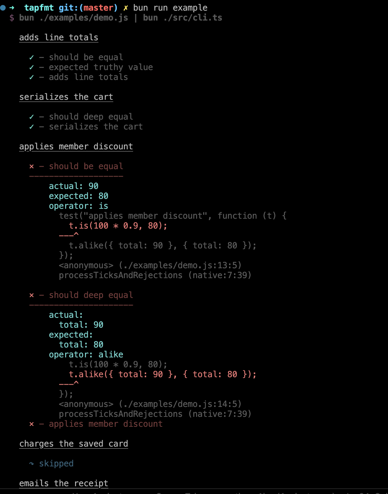

# prettytap

Pretty-print [TAP](https://testanything.org) (v13) as spec output or JSON.

## Install

```bash
npm install prettytap
```

CLI:

```bash
npm install -g prettytap
```

or `npx prettytap`.

## Example

This repo uses [brittle](https://github.com/holepunchto/brittle) as the TAP producer and formats it with `prettytap`:

```bash
node examples/demo.js | npx prettytap
```

A saved TAP stream works the same:

```bash
cat test/fixtures/example.txt | npx prettytap
```



## Formats

- `spec` (default)
- `json`

```bash
cat results.tap | prettytap -f json
```

## Library

```js
const { parse, SpecFormatter, JsonFormatter } = require('prettytap')

const results = parse(`TAP version 13
1..2
ok 1 test 1
not ok 2 test 2
`)

const spec = new SpecFormatter()
console.log(spec.formatToString(results))
console.log(spec.summaryToString())

const json = new JsonFormatter()
console.log(JSON.stringify(json.toJson(results), null, 2))
```

## API

#### `const results = parse(input)`

Parse a complete TAP string (or array of lines) into a `results` object.

#### `const parser = new Parser()`

Incremental parser for a TAP stream.

- `parser.write(chunk)` — feed a chunk, returns an array of events
- `parser.end()` — flush the trailing line, returns any remaining events
- `parser.results` — the `results` object, updated in place

Events are `{ type: 'test', test }`, `{ type: 'yaml', test }`, `{ type: 'comment', text }`
and `{ type: 'bail', reason }`.

#### `isPassing(results)`

Whether every expected test passed. Also available as `results.isPassing()`.

#### `resultsToString(results)`

Plain-text summary of a `results` object. Also available as `results.toString()`.

#### `const formatter = new SpecFormatter()`

- `formatter.formatToString(results)` — the spec body
- `formatter.summaryToString()` — the totals, after `formatToString`
- `formatter.format(results)` / `formatter.summary()` — the same, written to stdout

Streaming, for use with `Parser` events:

- `formatter.streamStart(results)` — reset for a new stream
- `formatter.streamTest(test)` / `streamYaml(test)` / `streamBail(reason)` — return a string
- `formatter.streamComment(text)` — record the next suite heading

#### `const formatter = new JsonFormatter()`

- `formatter.toJson(results)` — a plain object
- `formatter.formatToString(results)` — the same, stringified
- `formatter.format(results)` — the same, written to stdout

#### `formatSpec(results)` / `formatJson(results)`

One-shot helpers that construct a formatter, print, and return it.

#### Colors

`bold`, `faint`, `dim`, `italic`, `underline`, `red`, `green`, `yellow`, `blue`, `magenta`,
`cyan`, `brightRed`, `brightMagenta`, plus `stripAnsi(str)`, `isColorEnabled()` and
`setColorEnabled(enabled)`. Color is off when stdout is not a TTY, or with `NO_COLOR` /
`--no-color`, and forced on with `FORCE_COLOR` / `--color`.

## Why

TAP is a cross-language protocol. Formatters usually are not — they ship tied to one runtime. `prettytap` is a CLI and a library you can pipe any TAP stream into.

```bash
node examples/demo.js | prettytap
npm test | prettytap
cat results.tap | prettytap
```

## License

MIT
